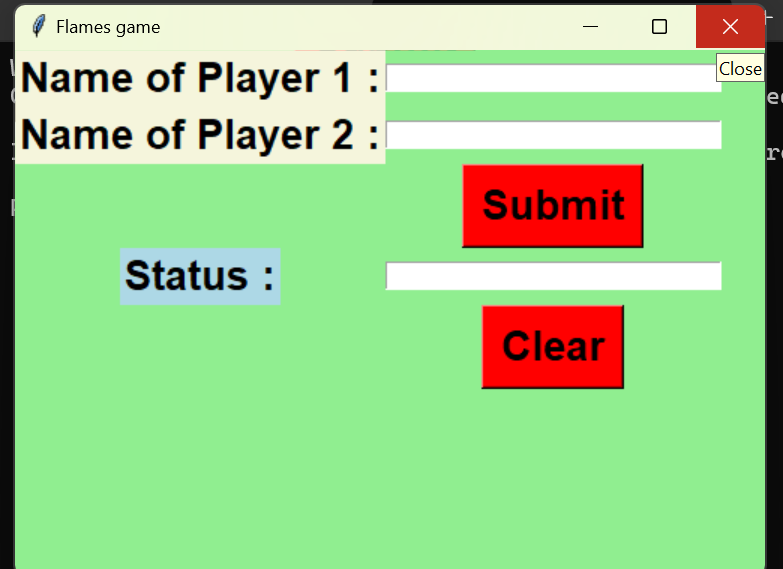

# FLAMES Game

The **FLAMES game** is a fun and interactive game that determines the relationship status between two names based on a simple algorithm. The game is based on the popular method of predicting future relationships by comparing the letters of two people's names.

This project is implemented in **Python** using the **Tkinter** library for creating the graphical user interface (GUI).

---

## Features

- Simple and user-friendly interface.
- Calculates the relationship status (Friends, Love, Affection, Marriage, Enemy, Siblings) based on two people's names.
- Provides a fun and interactive way to predict relationship status.

---

## Requirements

To run the FLAMES game, you need:

- **Python 3.x** (preferably 3.6+)
- **Tkinter** library (usually comes pre-installed with Python)

---

## Installation

1. Clone the repository:

    ```bash
    git clone https://github.com/SweetySinha/Flames-game.git
    ```

2. Navigate to the project directory:

    ```bash
    cd Flames-game
    ```

## Running the Game

1. In your terminal, navigate to the project directory and run the `main.py` file:

    ```bash
    python main.py
    ```

2. The game window will appear, and you can start playing by entering the names of two players.

---

## Usage

- Enter the names of **Player 1** and **Player 2** in the provided fields.
- Click the **Submit** button to see the predicted relationship status.
- Click the **Clear** button to reset the fields.

---

## Contributing

If you'd like to contribute to this project, feel free to fork the repository and submit a pull request. Contributions are always welcome!

1. Fork the repository.
2. Clone your fork to your local machine.
3. Create a new branch for your feature.
4. Commit your changes and push them to your fork.
5. Create a pull request.

---

## Screenshot

Here’s a screenshot of the working **FLAMES game**:



